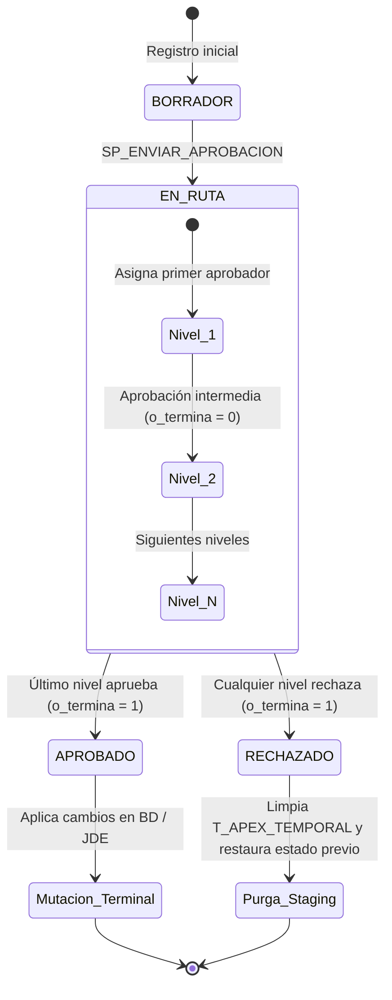
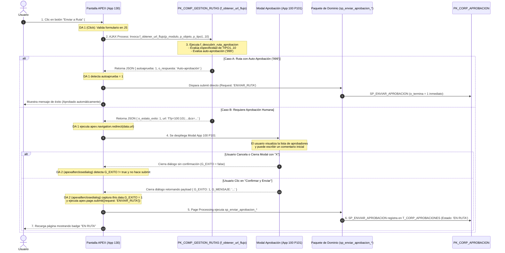

# 04 — Motor de Aprobaciones Corporativas y los 5 Dominios Canónicos

Este documento describe la máquina de estados, el ciclo de vida de una aprobación, la persistencia en staging y el protocolo de comunicación entre el motor central y los paquetes de dominio.

---

## 1. Ciclo de Vida y Máquina de Estados

El motor de aprobaciones maneja transiciones síncronas (en pantalla) y asíncronas (en segundo plano vía cola de procesamiento).



---

## 2. Estructura de la Tabla `DATA.T_CORP_APROBACIONES`

Es la tabla central que almacena todas las instancias de solicitud de aprobación:

| Columna | Tipo | Descripción |
| :--- | :--- | :--- |
| `ID` | `NUMBER` | Identificador único de la solicitud de aprobación (PK). |
| `COMPANIA` | `VARCHAR2(10)` | Código de compañía (ej. `'00001'`). |
| `CODMODULO` | `VARCHAR2(50)` | Módulo corporativo (`'COMP'`, `'RRHH'`, `'ADMI'`). |
| `TIPOPROCESO` | `VARCHAR2(50)` | Tipo de proceso funcional. |
| `NUMEROPROCESO` | `VARCHAR2(100)` | ID del registro en la tabla de dominio (ej. ID de Negociación, ID de Ruta). |
| `DESCRIPCION1..5` | `VARCHAR2(4000)` | Metadatos y badges visuales para la Mesa de Trabajo (P290). |
| **`ETIQUETA1`** | `VARCHAR2(100)` | **Dominio canónico estricto** (`ORDENES_COMPRA`, `PRODUCTOS_ALTERNOS`, `PROVEEDORES`, `NEGOCIACIONES`, `RUTAS`). |
| `ETIQUETA2` | `VARCHAR2(100)` | Subdominio o tipo secundario (ej. `'RUTA'`, `'PROVEEDOR'`). |
| `ETIQUETA3` | `VARCHAR2(100)` | Intención / Tipo de operación (`'CREACION'`, `'MODIFICACION'`, `'INACTIVACION'`, `'REACTIVACION'`). |
| `ESTADO` | `VARCHAR2(50)` | Estado actual (`'EN RUTA'`, `'APROBADO'`, `'RECHAZADO'`, `'PENDIENTE_APROBAR'`, `'PENDIENTE_RECHAZAR'`). |
| `USUARIOACTUAL` | `VARCHAR2(100)` | Usuario que tiene la aprobación pendiente en su bandeja. |
| `IDRUTAAPROBACION` | `NUMBER` | ID de la ruta asignada. |
| `IDFLUJOAPROBACION`| `NUMBER` | ID de la instancia de flujo en `VT_FLUJO_APROBACION`. |
| **`OBJETO0`** | `CLOB` | **Snapshot JSON** con el estado completo de los datos al momento del envío. |
| **`OBJETO1`** | `CLOB` | **Snapshot HTML** renderizado para visualización directa e instantánea en la Mesa de Trabajo (P290). |

---

## 3. Protocolo de Despacho de Dominios (`sp_procesar_cola`)

Cuando una aprobación o rechazo se ejecuta en segundo plano o desde la Mesa de Trabajo, `DATA.PK_CORP_APROBACION.sp_procesar_cola` despacha la llamada según `ETIQUETA1`:

```sql
v_dominio := upper(trim(r.etiqueta1));

if r.codmodulo = 'COMP' then
    case v_dominio
        when 'ORDENES_COMPRA' then
            data.pk_comp_ordenescompra_v2.sp_aprobar(r.compania, r.usuarioinicia, to_number(r.numeroproceso), v_resp_dominio, v_exito_dominio);
        when 'PRODUCTOS_ALTERNOS' then
            data.pk_comp_productosalternos.sp_aprobar(r.compania, r.usuarioinicia, to_number(r.numeroproceso), v_resp_dominio, v_exito_dominio);
        when 'PROVEEDORES' then
            data.pk_corp_librodirecciones.sp_aprobar(r.compania, r.usuarioinicia, to_number(r.numeroproceso), v_resp_dominio, v_exito_dominio);
        when 'NEGOCIACIONES' then
            data.pk_comp_negociacion_v2.sp_aprobar(r.compania, r.usuarioinicia, to_number(r.numeroproceso), v_resp_dominio, v_exito_dominio);
        when 'RUTAS' then
            data.pk_comp_gestion_rutas.sp_aprobar(r.compania, r.usuarioinicia, to_number(r.numeroproceso), v_resp_dominio, v_exito_dominio);
        else
            v_resp_dominio := 'Dominio COMP no soportado: ' || v_dominio;
            v_exito_dominio := 0;
    end case;
else
    v_resp_dominio := 'Módulo corporativo no soportado: ' || r.codmodulo;
    v_exito_dominio := 0;
end if;
```

---

## 4. Patrón de Staging de Cambios (`DATA.T_APEX_TEMPORAL`)

Para evitar que una modificación no autorizada altere registros productivos vigentes, se utiliza el patrón **Staging en Temporal**:

1. **Captura:** El usuario edita un registro activo en pantalla.
2. **Comparación:** Se genera un JSON diferencial (`diffs`) con el valor anterior y el propuesto.
3. **Persistencia Staging:** Se inserta en `DATA.T_APEX_TEMPORAL` con:
   - `FLAG = 'CAMBIO_CFG_RUTA'` o `'MODIF_PROVEEDOR'`
   - `CONTROL01 = TO_CHAR(ID_REGISTRO)`
   - `CLOB01 = JSON_DIFFS_Y_PAYLOAD`
4. **Visualización:** `sp_html_ruta` o `sp_html_proveedor` lee `T_APEX_TEMPORAL` y renderiza la pestaña *Modificaciones Solicitadas*.
5. **Resolución Terminal:**
   - **Si APROBADO:** El procedimiento de dominio aplica los valores de `CLOB01` a la tabla productiva y borra el registro de staging.
   - **Si RECHAZADO:** Se borra el registro temporal y se restaura el estado a `ACTIVO` sin tocar los datos previos.

---

## 5. Auto-Aprobación Inmediata

Si una ruta de aprobación está configurada con `'999'` o el usuario iniciador coincide con el único nivel autorizador:
1. `SP_ENVIAR_APROBACION` retorna `o_termina = 1` en la misma invocación.
2. El paquete emisor ejecuta inmediatamente su procedimiento terminal (ej. `sp_ejecutar_mutacion_terminal` o actualización directa).
3. El estado final queda como `APROBADO` sin requerir paso por cola ni intervención manual.

---

## 6. Procedimiento Estándar para "Enviar a Ruta" (Frontend APEX $\to$ `f_obtener_url_flujo` $\to$ Modal App 100 P101)

### 6.1. Filosofía Arquitectónica y Razón de Diseño

En los sistemas tradicionales, un botón "Enviar a Aprobación" solía insertar directamente un registro en una tabla o abrir una página fija con código quemado. En este sistema corporativo, la asignación de aprobadores es **dinámica, multinivel y basada en reglas de especificidad**.

Para lograr desacoplamiento total entre las pantallas operativas (App 130) y el motor de aprobaciones, se diseñó un mecanismo basado en 3 principios fundamentales:

1. **Modal Corporativo Compartido (App 100 Página 101):**  
   Existe una aplicación central (`App 100`) que es utilizada por toda la corporación (Compras, RRHH, Finanzas, Comercio Exterior). La pantalla operativa no necesita construir una interfaz para mostrar aprobadores; delega esa vista al modal institucional.
2. **Generación Segura de URLs con Checksum:**  
   Oracle APEX protege el estado de sesión mediante *Session State Protection* (SSP). No es posible construir una URL hacia otra página simplemente concatenando strings en JavaScript sin provocar un error de checksum. Por ello, la URL hacia la App 100 debe ser generada exclusivamente desde el servidor mediante `apex_page.get_url`.
3. **Resolución en Dos Fases Asíncronas (Las 2 Dynamic Actions):**  
   En la web, abrir un diálogo modal no bloquea el hilo de ejecución de JavaScript. Si intentáramos validar, abrir el modal y guardar todo en un solo bloque de código, la página guardaría los datos antes de que el usuario siquiera vea quiénes son sus aprobadores. Por este motivo, el proceso se divide obligatoriamente en **dos fases desacopladas**:
   - **Fase 1 (DA de Clic):** Consulta al backend qué ruta corresponde y abre el modal corporativo.
   - **Fase 2 (DA de Retorno):** Escucha el cierre del modal (`apexafterclosedialog`), verifica si el usuario confirmó la operación y recién allí ejecuta el guardado en base de datos. Si el usuario canceló el modal o lo cerró con la "X", el sistema no hace nada y la base de datos queda intacta.

---

### 6.2. Diagrama de Secuencia y Comunicación entre Componentes

El siguiente diagrama ilustra el viaje de los datos desde que el usuario presiona el botón hasta que la solicitud queda formalmente registrada en `T_CORP_APROBACIONES`:



---

### 6.3. Contrato Técnico de la Función `f_obtener_url_flujo`

Esta función es la **única puerta de entrada autorizada** para preparar el envío a ruta. Se encuentra en `DATA.PK_COMP_GESTION_RUTAS`.

#### Parámetros de Entrada:
```sql
FUNCTION f_obtener_url_flujo (
    p_compania           IN VARCHAR2,                       -- Código de compañía (ej. '00001')
    p_usuario            IN VARCHAR2,                       -- Usuario en sesión (:APP_USER)
    p_modulo             IN VARCHAR2,                       -- Módulo funcional (ej. 'COMP')
    p_objeto             IN VARCHAR2,                       -- Nombre de la entidad (ej. 'LIBRODIRECCIONES_PROVEEDOR')
    p_objeto_id          IN VARCHAR2,                       -- Identificador de la entidad (soporta alfanuméricos)
    p_objeto_descripcion IN VARCHAR2,                       -- Título descriptivo que aparecerá en el encabezado del modal
    p_tipo1              IN VARCHAR2 DEFAULT NULL,          -- Criterio Tipo 1 (ej. 'LIBRODIRECCION', 'ORDENCOMPRA')
    p_tipo2              IN VARCHAR2 DEFAULT NULL,          -- Criterio Tipo 2 (ej. 'PROVEEDOR', 'NACIONAL')
    p_tipo3              IN VARCHAR2 DEFAULT NULL,          -- Criterio Tipo 3 (ej. 'CREACION', 'MODIFICACION')
    p_tipo4              IN VARCHAR2 DEFAULT NULL,          -- Criterios auxiliares Tipo 4 al 10 según la ruta
    p_tipo5              IN VARCHAR2 DEFAULT NULL,
    p_tipo6              IN VARCHAR2 DEFAULT NULL,
    p_tipo7              IN VARCHAR2 DEFAULT NULL,
    p_tipo8              IN VARCHAR2 DEFAULT NULL,
    p_tipo9              IN VARCHAR2 DEFAULT NULL,
    p_tipo10             IN VARCHAR2 DEFAULT NULL,
    p_triggering_element IN VARCHAR2 DEFAULT '#ENVIAR_RUTA' -- Selector jQuery del botón padre que recibirá el evento de cierre
) RETURN CLOB;
```

#### Estructura del JSON Retornado:
La función siempre retorna una cadena JSON (`CLOB`) con el siguiente esquema estricto:

```json
{
  "o_estato_exito": 1,
  "o_respuesta": "URL generada exitosamente",
  "autoaprueba": 0,
  "url": "f?p=100:101:1234567890::::G_OBJETO_ID,G_OBJETO,...:125,LIBRODIRECCIONES_PROVEEDOR,...&cs=3ABCDEF123456"
}
```

- **`o_estato_exito = 0`**: Ocurrió un error o no se encontró ninguna regla configurada en `T_CORP_CFGAPROBADORES` que coincida con los criterios enviados. El mensaje descriptivo viene en `o_respuesta`.
- **`autoaprueba = 1`**: La ruta descubierta contiene `'999'`. No se genera URL porque no se requiere interacción humana; la pantalla debe proceder con el submit inmediato.
- **`autoaprueba = 0` y `url` poblada**: Se localizó una ruta válida con aprobadores humanos y se generó la URL firmada hacia la App 100 P101.

---

### 6.4. Explicación Detallada de los 4 Componentes en APEX (Referencia: Página 275)

Para que el desarrollador entienda exactamente qué rol cumple cada elemento dentro del Page Designer de APEX, analizamos la implementación canónica de la **Página 275 (Proveedores)**:

```
Página APEX (ej. Página 275)
├── 1. Proceso AJAX On-Demand (GET_MODAL_URL_RUTA)
├── 2. Acción Dinámica 1: ABRIR_MODAL_ENVIAR_RUTA (Trigger: Click en #ENVIAR_RUTA)
├── 3. Acción Dinámica 2: ENVIAR_APROBACION (Trigger: apexafterclosedialog en #ENVIAR_RUTA)
└── 4. Proceso de Submit de Página (Processing: Request = 'ENVIAR_RUTA')
```

---

#### Componente 1: Proceso AJAX On-Demand (`GET_MODAL_URL_RUTA`)
- **Ubicación:** `Page Processing` $\rightarrow$ Pestaña de Procesos $\rightarrow$ Sección `Ajax Callback`.
- **Propósito:** Ejecuta la lógica PL/SQL del lado del servidor de forma asíncrona cuando JavaScript lo solicita, sin recargar la página.
- **Qué hace:**
  1. Si la entidad está en estado `ACTIVO` (es una modificación), extrae los cambios del formulario y los guarda en la tabla de staging temporal `DATA.T_APEX_TEMPORAL`.
  2. Invoca `DATA.PK_COMP_GESTION_RUTAS.f_obtener_url_flujo` pasando las variables de sesión (`:G_COMPANIA`, `:APP_USER`, `:P275_ID`, etc.) y los valores `TIPO1..10`.
  3. Imprime el resultado JSON directamente al buffer HTTP mediante `htp.p`.

```sql
DECLARE
    v_valido NUMBER := 1;
    v_msg    VARCHAR2(4000);
BEGIN
    -- 1. Validaciones previas de negocio
    IF apex_application.g_x01 = 'INACTIVACION' THEN
        DATA.PK_CORP_LIBRODIRECCIONES.sp_validar_inactivacion_proveedor(
            p_id_proveedor => :P275_ID,
            o_es_valido    => v_valido,
            o_mensaje      => v_msg
        );
    END IF;

    IF v_valido = 0 THEN
        APEX_JSON.INITIALIZE_CLOB_OUTPUT;
        APEX_JSON.OPEN_OBJECT;
        APEX_JSON.WRITE('o_estato_exito', 0);
        APEX_JSON.WRITE('o_respuesta', v_msg);
        APEX_JSON.CLOSE_OBJECT;
        htp.p(APEX_JSON.GET_CLOB_OUTPUT);
        APEX_JSON.FREE_OUTPUT;
        RETURN;
    END IF;

    -- 2. Llamada a la función centralizada de rutas
    htp.p(DATA.PK_COMP_GESTION_RUTAS.f_obtener_url_flujo(
        p_compania           => :G_COMPANIA,
        p_usuario            => :APP_USER,
        p_modulo             => 'COMP',
        p_objeto             => 'LIBRODIRECCIONES_PROVEEDOR',
        p_objeto_id          => :P275_ID,
        p_objeto_descripcion => :P275_OBJETO_DESCRIPCION,
        p_tipo1              => 'LIBRODIRECCION',
        p_tipo2              => 'PROVEEDOR',
        p_tipo3              => CASE WHEN :P275_ESTADO = 'INGRESADO' THEN 'CREACION' ELSE 'MODIFICACION' END,
        p_triggering_element => apex_application.g_x02
    ));
EXCEPTION
    WHEN OTHERS THEN
        APEX_JSON.INITIALIZE_CLOB_OUTPUT;
        APEX_JSON.OPEN_OBJECT;
        APEX_JSON.WRITE('o_estato_exito', 0);
        APEX_JSON.WRITE('o_respuesta', 'Error en GET_MODAL_URL_RUTA: ' || SQLERRM);
        APEX_JSON.CLOSE_OBJECT;
        htp.p(APEX_JSON.GET_CLOB_OUTPUT);
        APEX_JSON.FREE_OUTPUT;
END;
```

---

#### Componente 2: Acción Dinámica 1 — `ABRIR_MODAL_ENVIAR_RUTA` (Evento: Click)
- **Ubicación:** `Dynamic Actions` $\rightarrow$ Evento `Click` sobre el botón `#ENVIAR_RUTA`.
- **Propósito:** Interceptar el clic del usuario, validar el formulario en el cliente y solicitar la URL al servidor.
- **Qué hace:**
  1. Limpia errores previos en pantalla (`apex.message.clearErrors()`) y corre validaciones JavaScript de campos obligatorios.
  2. Ejecuta `apex.server.process("GET_MODAL_URL_RUTA", ...)` enviando los valores actuales de los items de página en `pageItems`.
  3. Al recibir la respuesta:
     - Si `autoaprueba === 1`: Salta el modal y envía el formulario directamente con `apex.page.submit({ request: "ENVIAR_RUTA", showWait: true })`.
     - Si `data.url`: Abre el modal corporativo invocando `apex.navigation.redirect(data.url)`.
     - Si hay error: Muestra el mensaje de alerta al usuario (`mensajeError(data.o_respuesta)`).

```javascript
apex.message.clearErrors();

// 1. Validar campos obligatorios en el cliente antes de llamar al servidor
var errores = validarCamposProveedor();
if (errores.length > 0) {
    apex.message.showErrors(errores);
    return;
}

var vTipo = apex.item("P275_ESTADO").getValue() === "INGRESADO" ? "CREACION" : "MODIFICACION";

// 2. Llamada AJAX al proceso del servidor
apex.server.process("GET_MODAL_URL_RUTA", {
    pageItems: "#P275_ID,#P275_ESTADO,#P275_OBJETO,#P275_OBJETO_DESCRIPCION",
    x01: vTipo,
    x02: "#ENVIAR_RUTA"
}, {
    success: function(data) {
        if (data.o_estato_exito === 1 || data.o_estato_exito === "1") {
            if (data.autoaprueba === 1 || data.autoaprueba === "1") {
                // Caso A: Auto-aprobación -> Submit directo
                apex.page.submit({
                    request: "ENVIAR_RUTA",
                    showWait: true
                });
            } else if (data.url) {
                // Caso B: Redirección al modal seguro App 100 P101
                apex.navigation.redirect(data.url);
            }
        } else {
            mensajeError(data.o_respuesta || "No se encontró ruta de aprobación.");
        }
    },
    dataType: "json"
});
```

---

#### Componente 3: Acción Dinámica 2 — `ENVIAR_APROBACION` (Evento: Dialog Closed)
- **Ubicación:** `Dynamic Actions` $\rightarrow$ Evento `Dialog Closed` (`apexafterclosedialog`) sobre el botón `#ENVIAR_RUTA`.
- **Propósito:** Recibir el resultado devuelto por el modal de la App 100 cuando el usuario termina su interacción.
- **Qué hace:**
  1. Lee el objeto `this.data` inyectado automáticamente por el framework de diálogos de APEX.
  2. Evalúa `this.data.G_EXITO`:
     - Si es `true` o `1` (el usuario confirmó en el modal): Dispara el submit final de la página con `apex.page.submit({ request: "ENVIAR_RUTA", showWait: true })`.
     - Si el usuario cerró el modal o hubo un error: No hace submit y muestra el mensaje correspondiente.

```javascript
// 1. Capturar el payload que devuelve el modal cerrado (App 100 P101)
var data = this.data;
var exito = data.G_EXITO;
var mensaje = data.G_MENSAJE;

// 2. Evaluar si la confirmación en el modal fue afirmativa
if (exito === "true" || exito === true || exito === 1 || exito === "1") {
    // Dispara el submit de la página padre para persistir el envío en base de datos
    apex.page.submit({
        request: "ENVIAR_RUTA",
        showWait: true
    });
} else {
    if (mensaje) {
        mensajeError(mensaje);
    }
}
```

---

#### Componente 4: Proceso de Submit de Página (`Processing - Enviar a ruta`)
- **Ubicación:** `Page Processing` $\rightarrow$ Sección `Processing` (After Submit).
- **Condición de Ejecución:** `Request = 'ENVIAR_RUTA'`.
- **Propósito:** Ejecutar la mutación definitiva en base de datos una vez que la autorización en el modal fue confirmada.
- **Qué hace:**
  1. Invoca el procedimiento PL/SQL de dominio correspondiente (ej. `DATA.PK_CORP_LIBRODIRECCIONES.sp_enviar_aprobacion_proveedor`).
  2. El procedimiento de dominio cambia el estado a `EN RUTA`, serializa los snapshots `OBJETO0` (JSON) y `OBJETO1` (HTML) y registra la transacción en `DATA.T_CORP_APROBACIONES`.
  3. Si la operación falla, registra el error con `apex_error.add_error` para informar al usuario.

```sql
DECLARE
    v_resp VARCHAR2(4000);
    v_exit NUMBER;
BEGIN
    DATA.PK_CORP_LIBRODIRECCIONES.sp_enviar_aprobacion_proveedor(
        p_compania     => :G_COMPANIA,
        p_usuario      => :APP_USER,
        p_id_proveedor => :P275_ID,
        o_respuesta    => v_resp,
        o_estado_exito => v_exit
    );

    IF v_exit = 0 THEN
        apex_error.add_error(
            p_message          => v_resp,
            p_display_location => apex_error.c_inline_in_notification
        );
    END IF;
END;
```

---

### 6.5. Checklist para Implementar "Enviar a Ruta" en una Nueva Pantalla

Cuando el nuevo programador necesite habilitar el flujo de aprobación en una nueva pantalla (ej. Página 285 Negociaciones, Página 278 Rutas, etc.), debe seguir este checklist:

1. **Crear el Botón:** Crear botón `#ENVIAR_RUTA` (o `#BTN_ENVIAR_RUTA`) con *Behavior = Defined by Dynamic Action*.
2. **Crear Proceso Ajax Callback:** Crear proceso Ajax `GET_MODAL_URL_RUTA` que llame a `f_obtener_url_flujo` pasando el `p_modulo`, `p_objeto` y los tipos correspondientes.
3. **Crear DA 1 (Click):** Crear DA sobre el evento `Click` del botón que ejecute `apex.server.process` y evalúe `autoaprueba` vs `url`.
4. **Crear DA 2 (Dialog Closed):** Crear DA sobre el evento `Dialog Closed` del mismo botón que evalúe `this.data.G_EXITO` y haga `apex.page.submit({ request: 'ENVIAR_RUTA' })`.
5. **Crear Proceso de Submit:** En la pestaña `Processing`, crear el proceso PL/SQL condicionado a `REQUEST = 'ENVIAR_RUTA'` que invoque el `sp_enviar_aprobacion_*` del paquete de dominio.


