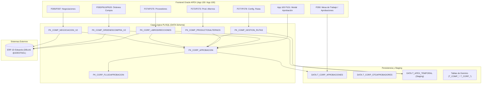

# Manual de Traspaso Técnico y Arquitectura (Handover) — Sistema de Compras APEX

**Aplicación:** APEX App 130 (Compras) / App 100 (Modal Corporativo de Aprobaciones)  
**Base de Datos:** Oracle Database 21c Standard Edition 2 (`zaitestdb.zaimella.com:1523 / ZAITEST`)  
**ERP Integrado:** JD Edwards EnterpriseOne 9.1 (`@JDEDTADL`)  
**Fecha de Elaboración:** Septiembre 2026  
**Responsable Saliente:** Moises Ferrin (Senior Software Architect / Lead Developer)  

---

## 1. Propósito de este Manual

Este repositorio contiene la solución empresarial de **Gestión de Compras y Flujos de Aprobación Corporativos** de Zaimella. El objetivo de este manual es transferir al nuevo desarrollador/arquitecto todo el conocimiento técnico, decisiones de arquitectura, estructura de base de datos, lógica de negocio en PL/SQL, componentes Oracle APEX y procedimientos de despliegue y mantenimiento.

---

## 2. Estructura de la Documentación

La documentación se divide en módulos especializados para facilitar la consulta y el onboarding:

```
docs/handover/
├── README.md                               # Este archivo: Guía rápida y visión general
├── 01_arquitectura_y_estandares.md        # Estándares de desarrollo, auditoría y logging
├── 02_mapa_paquetes_bd.md                 # Catálogo exhaustivo de los 12 paquetes PL/SQL
├── 03_mapa_pantallas_apex.md              # Catálogo funcional de las 36 páginas APEX
├── 04_flujo_aprobaciones_y_dominios.md    # Motor de aprobaciones corporativas y los 5 dominios
└── 05_operacion_deploy_y_entorno.md       # Scripts PowerShell, VPN, conexión y despliegues
```

---

## 3. Visión General del Sistema y Flujo de Negocio

El sistema centraliza las operaciones de abastecimiento, catálogo de proveedores, listas de precios/negociaciones, maestros de productos alternos y la emisión de órdenes de compra con control presupuestario y flujos de aprobación jerárquicos multinivel.



---

## 4. Los 5 Dominios Canónicos de Aprobación

Toda entidad que pasa por autorización corporativa pertenece a uno de estos **5 dominios estandarizados** en `T_CORP_APROBACIONES.ETIQUETA1`:

| Dominio (`ETIQUETA1`) | Paquete Responsable | Descripción de Negocio |
| :--- | :--- | :--- |
| **`ORDENES_COMPRA`** | `DATA.PK_COMP_ORDENESCOMPRA_V2` | Aprobación de órdenes de compra consolidadas e individuales. |
| **`PRODUCTOS_ALTERNOS`** | `DATA.PK_COMP_PRODUCTOSALTERNOS` | Creación, inactivación y reactivación de productos alternos. |
| **`PROVEEDORES`** | `DATA.PK_CORP_LIBRODIRECCIONES` | Creación y actualización de ficha de proveedores (staging de cambios). |
| **`NEGOCIACIONES`** | `DATA.PK_COMP_NEGOCIACION_V2` | Acuerdos comerciales, listas de precio, fórmulas y pagos recurrentes. |
| **`RUTAS`** | `DATA.PK_COMP_GESTION_RUTAS` | Definición y modificación de rutas/niveles de aprobadores por tipo y módulo. |

---

## 5. Checklist de Arranque Rápido para el Nuevo Desarrollador

1. **Configurar el Entorno:**
   - Asegurarse de tener conectividad VPN a la red corporativa (`.\vpn_ensure.ps1`).
   - Crear archivo `.env` en la raíz basado en las credenciales seguras de desarrollo (ver [Guía de Entorno](file:///D:/Users/mferrin/Documents/Compras/docs/handover/05_operacion_deploy_y_entorno.md)).
   - Verificar compilación rápida ejecutando: `powershell -File .\compile.ps1 src/logic/packages/bodies/pk_corp_aprobacion.pkb`.

2. **Reglas de Oro del Proyecto:**
   - **Auditoría automática:** NUNCA modificar `USERCREA`, `FECHCREA`, `USERMODI`, `FECHMODI` en PL/SQL; son mantenidos exclusivamente por triggers de base de datos.
   - **Historial .md obligatorio:** Cada vez que modifiques un paquete o vista, actualizá su respectivo archivo `.md` en la misma carpeta antes de hacer commit.
   - **Carpeta `tmp/`:** Scripts descartables o temporales SIEMPRE van en `tmp/` para no ensuciar la raíz del repositorio.
   - **Despliegues APEX:** Usar exportación/importación granular (`export_single_page.ps1` / `import_single_page.ps1`) para páginas individuales.
